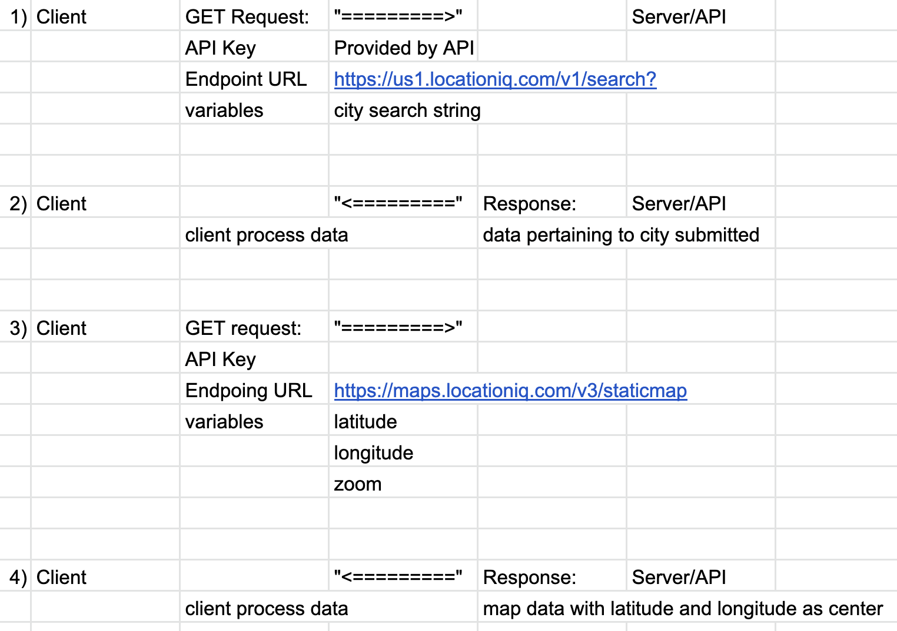

# City Explorer

**Author**: Jonathan Tsai
**Version**: 1.0.0 (increment the patch/fix version number if you make more commits past your first submission)

## Overview
This web application will provide releveant information about a city the user wants to explore.

## Getting Started
This web application uses React App, React Bootstrap and Axios, which require installation through `npm` before deployment.

## Architecture
This web application takes advantage of LocationIQ API to pull map data to display.

## Change Log
01-01-2001 4:59pm - Application now has a fully-functional through netlify: https://magnificent-semolina-4542c1.netlify.app/

## Credit and Collaborations
<!-- Give credit (and a link) to other people or resources that helped you build this application. -->

### Time log

Feature: Initial deployment to Netlify
Estimated time: 30 mins
Start Time: 12 PM
Finish Time: 12:30 PM
Actual Time: 12:30 PM

Feature: City Latitude and Longitude
Estimated time: 1 hour
Start Time: 12:30 PM
Finish Time: 1:30 PM
Actual Time: 2:30 PM

Feature: Generating city map
Estimated time: 1 hour
Start Time: 2:30 PM
Finish Time: 3:30 PM
Actual Time: 3 PM

Feature: Generating Error
Estimated tme: 1 hour
Start Time: 3 PM
End Time: 4 PM
Actual Time: 4 PM

Lab 6 WRRC
